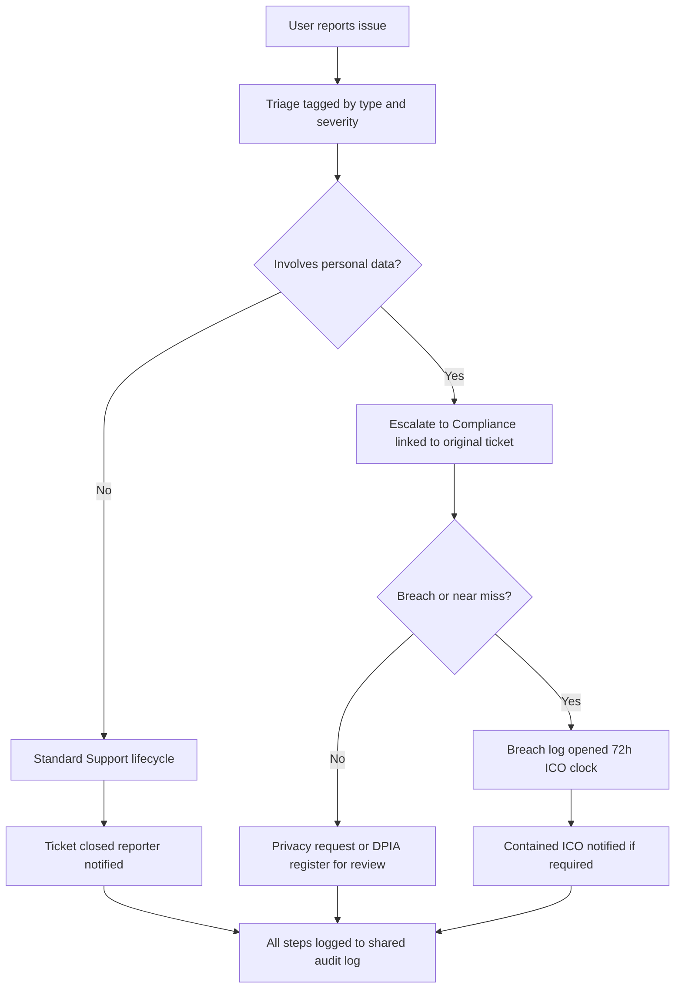

# EasyCarbs Support ↔ Compliance Workflow

Matches the EasyCarbs triage flowchart used for demo requests in AMS.

## Demo request routing

| Demo request | Involves personal data? | Destination | AMS record |
|--------------|-------------------------|-------------|------------|
| Remove My Health Information | **Yes** | Support intake → **auto-escalate to Compliance** privacy request (`data_correction`). Not a breach/near miss. | Ticket + linked `privacy_requests` row |
| Temporarily Disable My Account | **No** (operational) | **Support only** standard lifecycle | Support ticket; customer may be suspended |

## Implementation

- Flag: `support_tickets.involves_personal_data`
- Link: `support_tickets.privacy_request_id` ↔ `privacy_requests.support_ticket_id`
- Service: `SupportComplianceRoutingService`
- Listener: `RoutePersonalDataTicketToCompliance` on `SupportTicketCreated`
- Keyword fallback detects health/privacy language; operational “disable my account” is excluded from Compliance escalation
